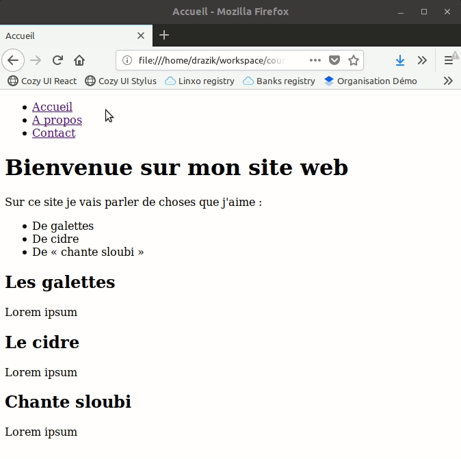

# TD HTML : les bases

L'objectif de ce premier TD est de créer quelques pages web présentant le
contenu de votre choix, en utilisant les éléments HTML les plus adaptés pour
chaque partie du contenu, et de lier ces pages entre elles en proposant un
menu.

## Exemple de résultat possible

3 pages :

* `index.html` : accueil du site
* `a-propos.html` : informations diverses à propos du site
* `contact.html` : informations de contact

