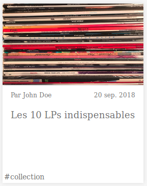
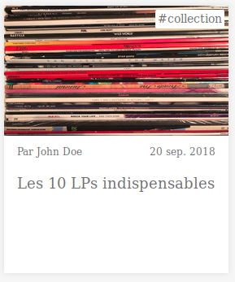

# TD CSS : Positionnement avancé

Dans ce TD, nous allons utiliser la propriété `position` pour ajouter quelques
détails à notre page web.

Vous trouverez dans le dossier [`src`]() le code HTML et CSS initial. Celui-ci
est un peu différent de là où nous nous étions arrêtés lors du TD précédent. En
effet, quelques adaptations ont été nécessaires pour pouvoir implémenter les
nouveautés dont il va être question dans ce TD.

## Menu fixe

Premièrement, nous allons faire en sorte que le menu soit fixe. C'est à dire
que lorsqu'on scrolle dans la page, celui-ci reste toujours visible en haut :

Pour cela, `position: fixed;` devrait vous aider.

## Sommaire de l'article « sticky »

Ensuite, vous voyez que sur un écran assez large, un sommaire contenant des
liens vers les différentes parties de l'article s'affiche. Actuellement,
celui-ci est affiché vers le haut de l'article. Nous allons faire en sorte que
celui-ci soit « sticky », c'est à dire qu'il suive le scroll tout en restant à
l'intérieur de son élément parent :

Utilisez `position: sticky;` !

## Tags des articles similaires

Enfin, si vous allez voir la section « articles similaires », vous voyez qu'un
nouvel élément est apparu dedans. Actuellement, celui-ci s'affiche de manière
normale dans le flux, donc après tous les autres.

En revanche, nous aimerions arriver à l'affichage suivant :

Vous allez devoir utiliser une combinaison de `position: relative;` et de
`position: absolute`. À vous de trouver sur quel élément appliquer quelle
propriété !
