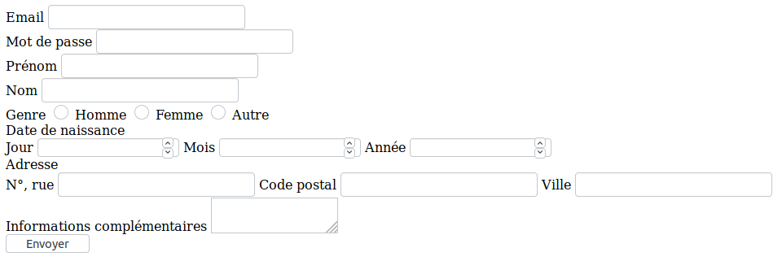

# TD HTML : Les formulaires

Nous allons développer un formulaire d'inscription à un service quelconque.

## Champs de saisie

Notre formulaire va contenir les champs suivants :

* Adresse email
* Mot de passe (pas de confirmation)
* Prénom
* Nom
* Genre (boutons radio : homme / femme / autre)
* Date de naissance (1 champ pour le jour, 1 champ pour le mois, 1 champ pour l'année)
* Adresse (1 champ pour la rue, 1 champ pour le code postal, 1 champ pour la ville)
* Informations complémentaire (champ multiligne libre)

Chaque champ doit être accompagné d'un label qui lui est correctement lié (attributs `for` sur le `label` et `id` sur l'`input`).

Exemple de rendu final :



## Envoi des données à un serveur

Un serveur récupérant les données pour les afficher est en ligne sur l'URL
`https://server-gowksslndc.now.sh/signup` Ce serveur ne fait pas réellement
d'inscription. Il se contente d'afficher les données de formulaire qu'il a
reçues. Un vrai système d'inscription nécessiterait du travail qui est
totalement hors du cadre de notre cours : chiffrement du mot de passe, stockage
des données dans une base de données, envoi d'un email de confirmation...

Adaptez votre formulaire pour que ses données soient envoyées sur `https://server-gowksslndc.now.sh/signup` avec une
méthode `POST`. Lorsque vous soumettrez le formulaire, vous verrez votre
navigateur web envoyer une requête puis vous afficher les données que le
serveur a reçues :

```
{
  "email": "toto@titi.com",
  "password": "pouetpouet",
  "firstname": "Toto",
  "lastname": "Titi",
  "gender": "on",
  "birthdate-day": "12",
  "birthdate-month": "10",
  "birthdate-year": "1979",
  "address-street": "143 avenue de versailles",
  "address-postalcode": "75016",
  "address-city": "Paris",
  "other-informations": "Truc\r\nBidule"
}
```

## Un peu de style

Dernière étape si il vous reste du temps. Notre formulaire est assez moche
actuellement, non ? Vous pouvez y appliquer les différentes techniques CSS que
nous avons vues ensemble dans les cours précédents pour le rendre plus
agréable. À vous de faire jouer votre imaginations !
