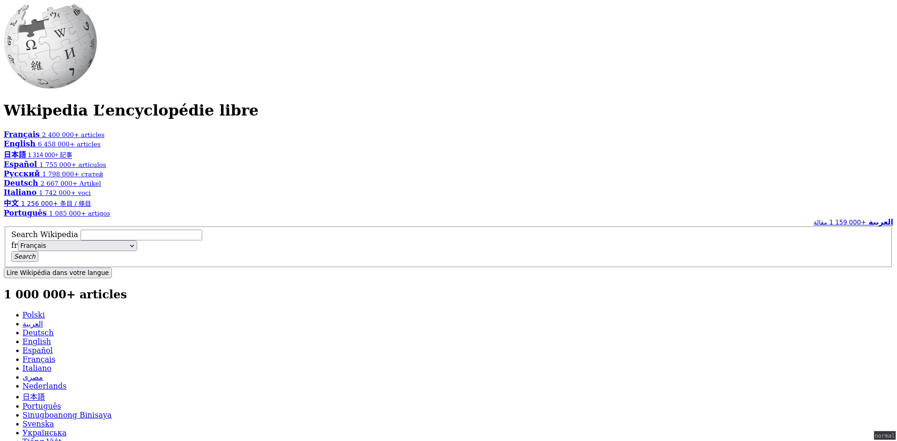

# CSS - Introduction

Avec HTML, on a décrit la structure du contenu de notre page. On a indiqué que
tel élément est un titre, tel élément est une section, une liste, etc... C'est
la brique de base d'une page web : sans contenu structuré, pas de page web.

CSS est l'acronyme de Cascading Style Sheets (feuilles de style en cascade en
français). Avec CSS, on va pouvoir décrire comment chaque élément doit
s'afficher : couleurs, positionnement, taille, bordures, taille de texte...

Par exemple, si on prend la page d'accueil de Wikipedia et qu'on désactive CSS,
on obtient :

|Sans CSS|Avec CSS|
|--------|--------|
|||

## Lier une feuille de styles à une page web

On va commencer tout de suite en créant un nouveau dossier qu'on va ouvrir dans
VS Code et dans lequel on va créer un fichier HTML:

```html
<!DOCTYPE html>
<html lang="fr">
	<head>
		<meta charset="UTF-8" />
		<title>Une page web swag</title>
	</head>

	<body>
		<p>On apprend le CSS !</p>
	</body>
</html>
```

Pour utiliser du CSS dans une page web, il faut lier la page à un fichier CSS.
Pour ça, on utilise la balise `<link />` qu'on place dans la balise `<head>`:

```html
<head>
	<meta charset="UTF-8" />
	<title>Une page web swag</title>
	<link rel="stylesheet" href="style.css" />
</head>
```

Notre page va maintenant tenter de charger le fichier `style.css` lorsqu'elle
est chargée. Ce fichier n'existe pas, donc pour le moment ça produira une
erreur 404 dans l'onglet réseau des devtools. Nous allons donc créer le
fichier. Et on va tout de suite ajouter un peu de code CSS dedans de manière à
voir une différence dans la page lorsque le CSS est bien chargé et appliqué.

```css
p {
	color: red;
	font-size: 4rem;
}
```

Une fois ce fichier créé et enregistré, lorsqu'on recharge la page, on obtient
un texte en rouge et plus gros qu'il ne l'était précédemment.

## Première règle CSS 

Analysons ce qu'on a écrit dans ce fichier CSS :

```
p {
^
| sélecteur : permet de déterminer les éléments à cibler. Ici, on cible les éléments de type `p`.

  color: red;
	^^^^^  ^^^
	  |     | valeur de la déclaration. Ici on utilise le mot-clé `red`,
		|     | mais on peut préciser les couleurs dans plein de formats différents.
		|     | On en reparle en détails plus tard
		|
		| propriété de la déclaration : quelle "caractéristique" on souhaite définir
		| ici, la propriété `color` permet de définir la couleur du texte
	^^^^^^^^^^
	    |
			| déclaration

	font-size: 4rem;
	^^^^^^^^^  ^^^^
      |       | `rem` est une unité. Il existe de nombreuses unités (px, em, rem, deg...)
			|       | Une unité peut être absolue ou relative. Ici `rem` est une unité relative
			|       | `1rem` = 1*la taille de texte de l'élément racine (html, 16px par défaut dans la plupart des navigateurs)
			|       | ici l'élément aura donc une taille de texte égale à `64px` si la taille de texte du navigateur est à `16px`.
			|       | On reparle des unités un peu plus tard
			|       |
			|
			| `font-size` permet de définir la taille de texte de l'élément
}
```

L'ensemble est appelé une "règle" CSS.

## Les sélecteurs

### Sélecteur de type

Quand le sélecteur est composé uniquement du nom d'une balise, alors le
sélecteur ciblera tous les éléments de ce type.

```css
/* Tous les éléments `<p>` de la page recevront ces styles */
p {
  color: red;
}
```

### Sélecteur de classe

Quand le sélecteur est préfixé par un point (`.`), il ciblera tous les éléments
ayant une classe donnée. Les classes sont appliquées via l'attribut `class` des
éléments HTML.

```html
<p class="big">
	Ceci est un texte qui sera écrit en grand
</p>
```

```css
.big {
	font-size: 64px;
}
```

Un élément peut avoir plusieurs classes. Elles sont séparées par un (ou
plusieurs) espaces dans la valeur de l'attribut `class`.

```html
<p class="big uppercase">
	Ce texte sera écrit en grand et en majuscules
</p>
```

```css
.big {
	font-size: 64px;
}

.uppercase {
	text-transform: uppercase;
}
```

Ce système permet de composer des styles en appliquant plusieurs classes sur un
même élément.

### Sélecteur d'ID

Quand le sélecteur est préfixé par un `#`, alors il cible l'élément portant un
ID donné.

```html
<p id="warning-message">
	Ce texte sera écrit en orange
</p>
```

```css
#warning-message {
	color: orange;
}
```

Souvenez-vous qu'un ID est unique dans chaque page web. Cette méthode ne permet
de sélectionner qu'un seul élément.

### Sélecteur d'attribut

Lorsque le sélecteur contient des crochets, alors il cible les éléments qui ont
un attribut précis.

```html
<p lang="en">
	This is a text in english.
</p>
```

```css
[lang] {
	color: red;
}
```

On peut aussi cibler des éléments en fonction de la valeur associée à un
attribut.

```html
<p lang="en">
	This is a text in english.
</p>

<p lang="fr">
	Ceci est un texte en français
</p>
```

```css
[lang="en"] {
	color: red;
}

[lang="fr"] {
	color: blue;
}
```

### Pseudo-sélecteurs

#### Pseudo-classe

Les pseudo-classes permettent de cibler des éléments selon une classe
"virtuelle" qui représente généralement un état possible d'un élément. Les
pseudo-classes sont préfixées par `:`.

Par exemple, un élément peut être survolé par le pointeur. On peut cibler un
élément qui est dans cet état avec la pseudo-classe `:hover` :

```html
<p>
	Ce texte change de couleur quand on passe le curseur dessus
</p>
```

```css
:hover {
	color: red;
}
```

[Liste des pseudo-classes sur
MDN](https://developer.mozilla.org/fr/docs/Web/CSS/Pseudo-classes#liste_des_pseudo-classes_standards)

#### Pseudo-élément

Les pseudo-éléments permettent de cibler des éléments "virtuels". Ils sont
préfixés par `::`.

```html
<p>
	Hello world!
</p>
```

```css
::first-letter {
	font-size: 64px;
}
```

[Liste des pseudo-éléments sur
MDN](https://developer.mozilla.org/fr/docs/Web/CSS/Pseudo-elements#liste_des_pseudo-%C3%A9l%C3%A9ments).

## Combiner les sélecteurs

### Chaînage de sélecteurs

Chaîner les sélecteurs est équivalent à un `ET`. Dans l'exemple suivant, on
cible les éléments qui sont de type `p` ET qui ont la classe `important` ET qui
ont la classe `big` ET qui ont un attribut `lang` avec la valeur `fr` :

```css
p.important.big[lang="fr"] {
	font-size: 64px;
	font-weight: bold;
	text-transform: uppercase;
	color: red;
}
```

L'ordre des classes dans l'attribut `class` de l'élément n'a pas à être le même
que dans le chaînage. Que l'élément ait `class="important big"` ou `class="big
important"` ne change rien ici.

### Enfant (` `)

Lorsqu'on combine des sélecteurs en utilisant un espace (` `), on recherche des
éléments enfants (peu importe leur profondeur).

Dans l'exemple suivant, tous les éléments `p` qui sont enfants de la `section`
seront en rouge. Même celui qui est dans le `header`.

```html
<section>
	<header>
		<p>
			Paragraphe d'introduction de la section
		</p>
	</header>
	
	<p>
		Paragraphe de contenu de la section
	</p>
</section>
```

```css
section p {
	color: red;
}
```

### Enfant direct (`>`)

Lorsqu'on utilise un chevron `>`, on recherche aussi des enfants, mais cette
fois-ci uniquement les enfants directs. Les enfants situés à une profondeur
supérieure à 1 sont ignorés.

Dans l'exemple suivant, seul l'élément `p` qui n'est pas dans le `header` sera
en rouge.

```html
<section>
	<header>
		<p>
			Paragraphe d'introduction de la section
		</p>
	</header>
	
	<p>
		Paragraphe de contenu de la section
	</p>
</section>
```

```css
section > p {
	color: red;
}
```

### Voisin général (`~`)

Ce combinateur permet de cibler des éléments qui sont "voisins" d'un autre
élément.

Dans l'exemple suivant, tous les `li` seront en rouge, car ils sont tous
voisins les uns des autres.

```html
<ul>
	<li>Item 1</li>
	<li>Item 2</li>
	<li>Item 3</li>
	<li>Item 4</li>
</ul>
```

```css
li ~ li {
	color: red;
}
```

### Voisin direct (`+`)

Ce combinateur permet de cibler des éléments qui sont "voisins directs" d'un autre
élément.

Dans l'exemple suivant, tous les `li` sauf le premier seront en rouge, car à
partir du 2ème ils ont tous un élément voisin direct.

```html
<ul>
	<li>Item 1</li>
	<li>Item 2</li>
	<li>Item 3</li>
	<li>Item 4</li>
</ul>
```

```css
li + li {
	color: red;
}
```

## L'héritage

Partons d'une page web avec plusieurs types d'éléments :

```html
<!DOCTYPE html>
<html lang="fr">
	<head>
		<meta charset="UTF-8" />
		<title>Une page web swag</title>
		<link rel="stylesheet" href="style.css" />
	</head>

	<body>
		<h1>Les sélecteurs CSS</h1>

		<section>
			<h2>Première section</h2>
			<p>
				Adipisicing eius maxime id at error. Quo architecto perspiciatis molestiae
				odit quidem harum. Voluptatem facilis laboriosam nobis illum odio Libero
				delectus quasi amet quis tenetur dicta? Veniam labore iure minus.
			</p>
			<p>
				Adipisicing eius maxime id at error. Quo architecto perspiciatis molestiae
				odit quidem harum. Voluptatem facilis laboriosam nobis illum odio Libero
				delectus quasi amet quis tenetur dicta? Veniam labore iure minus.
			</p>
		</section>
		<section>
			<h2>Deuxième section</h2>
			<p>
				Adipisicing eius maxime id at error. Quo architecto perspiciatis molestiae
				odit quidem harum. Voluptatem facilis laboriosam nobis illum odio Libero
				delectus quasi amet quis tenetur dicta? Veniam labore iure minus.
			</p>
			<p>
				Adipisicing eius maxime id at error. Quo architecto perspiciatis molestiae
				odit quidem harum. Voluptatem facilis laboriosam nobis illum odio Libero
				delectus quasi amet quis tenetur dicta? Veniam labore iure minus.
			</p>
			<p>
				Adipisicing eius maxime id at error. Quo architecto perspiciatis molestiae
				odit quidem harum. Voluptatem facilis laboriosam nobis illum odio Libero
				delectus quasi amet quis tenetur dicta? Veniam labore iure minus.
			</p>
		</section>
		<section>
			<h2>Troisième section</h2>
			<p>
				Adipisicing eius maxime id at error. Quo architecto perspiciatis molestiae
				odit quidem harum. Voluptatem facilis laboriosam nobis illum odio Libero
				delectus quasi amet quis tenetur dicta? Veniam labore iure minus.
			</p>
			<p>
				Adipisicing eius maxime id at error. Quo architecto perspiciatis molestiae
				odit quidem harum. Voluptatem facilis laboriosam nobis illum odio Libero
				delectus quasi amet quis tenetur dicta? Veniam labore iure minus.
			</p>
		</section>
	</body>
</html>
```

```css
body {
	font-size: 22px;
}

p {
	color: purple;
}
```

Ici on cible deux types d'éléments :

* les éléments de type `body` (il n'y en a qu'un seul par page, mais qu'importe) : on leur affecte une taille de police de `22px`
* les éléments de type `p` : on leur affecte une couleur de texte (violet)

On remarque que bien qu'on ait affecté la `font-size` sur le body, les autres
éléments (`h1`, `h2`, `p`) sont aussi affectés par ce changement.

Pour les éléments `h1` et `h2`, si on inspecte le CSS qui leur est attribué par
défaut, on voit respectivement `font-size: 2em` et `font-size: 1.5em`. `em` est
une unité relative à la `font-size` de l'élément parent. `1em` équivaut à une
fois la font-size (en px) de l'élément parent. La valeur finale est donc `22px * 2 = 44px`.
Pour un `h2`, la valeur par défaut est `1.5em`, donc la valeur finale est
`22px * 1.5 = 33px`.

Pour l'élément `p`, en revanche, on ne voit pas de déclaration ayant pour
propriété `font-size`. Par conséquent l'élément hérite de la valeur de
`font-size` de son élément parent. La `font-size` finale des éléments `p` est
donc celle déclarée pour les éléments `body`. Toutes les propriétés ne se
propagent pas aux éléments enfant par héritage. Mais quand c'est le cas, c'est
généralement logique : taille de police, couleur de texte, graisse de police,
style de police...

## Cascade et spécificité

Maintenant qu'on sait pourquoi un élément sur lequel on n'a pas définit de
style peut tout de même recevoir des styles, penchons nous sur un cas plus
spécifique : que se passe-t-il si deux règles ciblent le même élément
définissent des valeurs différentes pour les mêmes propriétés ?

Gardons le HTML de l'exemple précédent, mais cette fois-ci appliquons le CSS
suivant :

```css
h1 {
	color: red;
}

h1 {
	color: blue;
}
```

Si on teste, on constate que le titre est bleu. La raison à cela est que
l'ordre d'apparition des règles dans le CSS joue un rôle dans ce cas : la règle
qui apparaît en dernier "gagne" face aux autres.

Mais si on modifie un peu le CSS en ciblant les éléments `h1` se trouvant à
l'intérieur des éléments `body` :

```css
body h1 {
	color: red;
}

h1 {
	color: blue;
}
```

On constate que le titre est maintenant rouge. Pourtant on cible toujours le
même élément : le `h1`. Mais le premier sélecteur a maintenant une
"spécificité" plus haute que le deuxième sélecteur. La spécificité est définie
par un "score" en 3 nombres. Notons ce score `X - Y - Z` où :

* `Z` est le nombre de sélecteurs de type (`ul`, `p`, `h1`, `body`...)
* `Y` est le nombre de sélecteurs de classe, d'attributs et de pseudo-classes
* `X` est le nombre de sélecteurs d'ID

Ici notre premier sélecteur a une spécificité de `0 - 0 - 2` alors que le
deuxième a une spécificité de `0 - 0 - 1`. Au final les deux ciblent les mêmes
éléments, mais puisque le premier sélecteur est la combinaisons de sélecteurs,
il a plus de "poids" (un score de spécificité plus haut) que le sélecteur
simple `h1`. Par conséquent, le navigateur choisit d'appliquer les styles du
premier sélecteur plutôt que ceux du deuxième.

Pour voir le concept de spécificité illustré, visitez [CSS
SpeciFISHity](https://specifishity.com/).

Notons toutefois que le sélecteur universel (`*`), les combinateurs (l'espace,
`+`, `>`, etc) et la pseudo-classe `:not` n'augmente pas la spécificité d'un
sélecteur.

Maintenant qu'on a comprit ça, corrigeons une approximation du point précédent
sur l'ordre d'apparition dans le CSS : lorsque deux règles dont les sélecteurs
ont le même score de spécificité, c'est la dernière qui apparaît dans le CSS
qui est appliquée.

## Bonnes pratiques

* Privilégier les classes : elles permettent de cibler précisément les éléments sur lesquels elles sont appliquées. En le combinant on obtient un très bon ratio flexibilité / spécificité
* Eviter les ID : une classe appliquée à un seul élément permet de se laisser la possibilité de pouvoir appliquer les mêmes styles à un autre élément dans le futur
