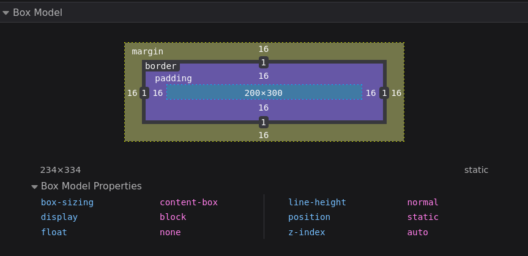
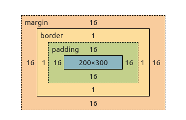

# CSS - Modèle de boite

Tous les éléments sont affichés à l'écran par le navigateur sous forme d'un rectanle ou de "boîte". Chaque élément a des dimensions : largeur (width) et hauteur (height). Les dimensions de ces boîtes sont définies par le "modèle de boîte" (box model en anglais).

## Boîte en ligne vs boîte de bloc

Il existe deux types distincts de boîtes : les boîtes en ligne (inline) et les boîtes de bloc (block). La différence entre ces deux types réside principalement dans la manière dont les boîtes de chaque type se comportent par rapport aux autres boîtes dans la page.

Pour les boîtes de type bloc :

* Par défaut, la boîte s'étend sur toute la largeur de son conteneur
* La boîte crée un retour à la ligne après l'élément qui la précède de manière à occuper sa propre ligne, et forçant l'élément suivant à passer à la ligne
* La largeur (width) et la hauteur (height) de l'élément sont respectées
* Les marges interne (padding), externes (margin) les bordures (border) ont pour effet de repousser les autres éléments

Certains éléments (par exemple les titres `h1`, `h2`... ainsi que les `p` ou même encore `html` et `body`) utilisent par défaut le type de boîte bloc.

Pour les boîtes en ligne :

* La boîte ne crée par de retour à la ligne, donc plusieurs boîtes en ligne peuvent se suivre sur une même ligne
* La largeur et la hauteur ne s'appliquent pas
* Les marges (externe et interne) ainsi que les bordures verticales sont appliquées mais ne repoussent pas les éléments autour
* Les marges (externe et interne) ainsi que les bordures horizontales sont appliquées et repoussent les éléments autour

Exemples d'éléments qui utilisent le type en ligne par défaut : `a`, `em`, `strong`...

## Modifier le type de boîte avec la propriété `display`

Il est possible de modifier le type de boîte utilisé par un élément grâce à la propriété `display`. Cette propriété peut prendre un grand nombre de valeurs différentes. Mais dans un premier temps concentrons nous sur 2 valeurs :

* `display: block` permet d'utiliser le type de boîte bloc sur un élément. Même si celui-ci utilisait le type en ligne par défaut
* `display: inline` permet d'utiliser le type de boîte en ligne sur un élément. Même si celui-ci utilisait le type bloc par défaut

Grâce à cette propriété et ces deux valeurs, on peut décider d'afficher des items de liste sur une ligne par exemple:

[](https://codesandbox.io/s/switch-to-inline-display-7iw3w2?fontsize=14&hidenavigation=1&theme=dark)

[Documentation de la propriété `display`](https://developer.mozilla.org/fr/docs/Web/CSS/display)

## Définir les dimensions d'un élément

Un élément a une largeur et une hauteur. Ces dimensions peuvent être définies avec les propriétés `width` et `height`:

[](https://codesandbox.io/s/width-height-example-01-plkjr0?fontsize=14&hidenavigation=1&theme=dark)

Attention, si le contenu d'un élément auquel on a donné des dimensions précises venait à dépasser ces dimensions, alors le contenu va "sortir" de l'élément:

[](https://codesandbox.io/s/width-height-example-overflow-3pjuwo?fontsize=14&hidenavigation=1&theme=dark)

Pour éviter ce genre de problème, la solution la plus simple est d'éviter de définir une hauteur spécifique. Dans ce cas, la hauteur de l'élément va dépendre du contenu:

[](https://codesandbox.io/s/width-height-example-height-auto-50qtz2?fontsize=14&hidenavigation=1&theme=dark)

Si on souhaite vraiment que l'élément ait une hauteur spécifique, on a deux possibilités :

* Cacher le contenu qui sort de l'élément
* Ajouter une barre de défilement

Les deux comportements se définissent avec la propriété `overflow`. Le premier utilise la valeur `hidden`, et le second la valeur `scroll` ou `auto`:

[](https://codesandbox.io/s/width-height-example-height-overflow-solution-n2u3ky?fontsize=14&hidenavigation=1&theme=dark)

On privilégie en générale les barres de défilement, pour éviter que du contenu soit complètement caché pour l'utilisateur.

[](https://codesandbox.io/s/min-max-width-height-zkxgf4?fontsize=14&hidenavigation=1&theme=dark)

- [Documentation de la propriété `width`](https://developer.mozilla.org/fr/docs/Web/CSS/width)
- [Documentation de la propriété `height`](https://developer.mozilla.org/fr/docs/Web/CSS/height)
- [Documentation de la propriété `overflow`](https://developer.mozilla.org/fr/docs/Web/CSS/overflow)
- [Documentation de la propriété `max-width`](https://developer.mozilla.org/fr/docs/Web/CSS/max-width)
- [Documentation de la propriété `max-height`](https://developer.mozilla.org/fr/docs/Web/CSS/max-height)

## Le modèle de boîte

Chaque boîte est composée de plusieurs parties :

* La boîte de contenu (content box) : c'est la zone où sont affichés les éléments contenus dans la boîte. Qu'il s'agisse de texte ou d'éléments HTML. Dans le modèle de boîte standard (cf ci-dessous), ce sont les dimensions de cette boîte qu'on définit lorsqu'on utilise les propriétés `width` et `height` pour définir une hauteur et une largeur
* La boîte de marge intérieure (padding box) : la marge interne (ou padding, litéralement "remplissage") est un espacement autour du contenu. On contrôle la taille de cet espacement avec la propriété `padding`
* La boîte de bordure (border box) : la bordure s'applique autour de la boîte de marge intérieure (et donc de la boîte de contenu). On peut définir son style (trait plein, tirets, pointillés...), sa couleur et sa taille avec la propriété `border`
* La boite de marge externe (margin box) : la marge externe englobe la boîte de bordure, la boîte de marge interne et la boîte de contenu. Il s'agit d'un espacement, mais cette fois-ci à l'extérieur de l'élément. Cette boîte permet d'espacer des éléments les uns des autres. On contrôlé la taille de cet espacement avec la propriété `margin`

Les outils de développement des navigateurs nous permettent de visualiser les caractéristiques de chaque "couche" du box model appliqué à un élément :

|Firefox|Chrome|
|-------|------|
|F12 puis onglet "Layout"|F12 puis onglet "Computed"|
|||

### Le modèle de boîte standard

Dans le modèle de boîte standard, lorsqu'on définit des dimensions (avec les propriétés `width` pour la largeur et `height` pour la hauteur), on définit en fait les dimensions de la boîte de contenu. Les dimensions des autres couches s'ajoutent aux dimensions définies via `width` et `height` (sauf les marges externes). Ainsi, dans l'exemple suivant, l'élément a une largeur finale de 236px et une hauteur finale de 186px :

[](https://codesandbox.io/s/box-model-standard-exemple-eil2vb?fontsize=14&hidenavigation=1&theme=dark)

Le calcul de la largeur inclut : `200px (width) + 16px (padding left) + 16px (padding right) + 2px (border left) + 2px (border right) = 236px`. Le calcul de la hauteur inclut : `150px (height) + 16px (padding left) + 16px (padding right) + 2px (border top) + 2px (border bottom) = 186px`.

Le fait de devoir prendre en compte toutes les couches dans le valeur finale de chaque dimension alors qu'on a donné une taille à chaque dimension est assez peu intuitif. C'est pourquoi un modèle de boîte alternatif a vu le jour.

### Le modèle de boîte alternatif

Dans le modèle de boîte alternatif, lorsqu'on définit une `width` et/ou une `height` sur un élément, celle-ci inclut les bordures, les marges internes et la boîte de contenu. Ainsi, on définit bien la taille finale d'un élément. La taille de la boîte de contenu est calculée automatiquement en prenant la taille finale et en y retirant la taille des bordures et des marges internes.

Pour activer ce modèle de boîte alternatif, il faut ajouter la propriété CSS suivante sur l'élément en question :

```css
box-sizing: border-box;
```

Il est très courant d'activer le modèle de boîte alternatif sur tous les éléments. Pour ça, on utilise généralement le CSS suivant :

```css
html {
	box-sizing: border-box;
}

*,
*::before,
*::after {
	box-sizing: inherit;
}
```

Le fait d'utiliser `inherit` sur le sélecteur `*, *::before, *::after` plutôt que d'appliquer directement `box-sizing: border-box` permet de plus facilement passer un sous-ensemble d'éléments vers le modèle de boîte standard si nécessaire, sans avoir à redéfinir le `box-sizing` de tous les éléments de l'ensemble manuellement. Pour en savoir plus, vous pouvez jeter un oeil à l'article [Inheriting box-sizing probably slightly better best-practice sur CSS Tricks](https://css-tricks.com/inheriting-box-sizing-probably-slightly-better-best-practice/).

Utiliser le modèle de boîte alternatif sur tous les éléments par défaut est particulièrement utile lorsqu'on définit les dimensions de certains éléments en unités relatives (par exemple en pourcentages). Car cela nous évite d'avoir à adapter cette taille en fonction des tailles de marges internes et de bordures qui vont être appliquées à l'élément. On donne simplement la dimension finale qu'on souhaite que l'élément ait à l'affichage, et tout le reste s'adapte automatiquement.

On va donc en général embarquer ces deux règles CSS dans toutes nos pages.

[Documentation de la propriété `box-sizing`](https://developer.mozilla.org/fr/docs/Web/CSS/box-sizing)

### Marges internes

La marge interne permet de créer un espacement entre le bord d'un élément et sa boîte de contenu. On peut facilement la matérialiser en donnant une couleur ou une image de fond, et en ajoutant des marges internes à un élément avec les propriétés `padding-left`, `padding-right`, `padding-top` et `padding-bottom` :

[](https://codesandbox.io/s/padding-example-01-yzevji?fontsize=14&hidenavigation=1&theme=dark)

Il existe aussi la propriété raccourcie `padding`. Celle-ci peut prendre de 1 à 4 valeurs distinces :

* 1 valeur : valeur appliquée aux 4 côtés (haut, bas, gauche, droite)
* 2 valeurs : la 1ère valeur est appliquée en haut et en bas et la 2ème valeur est appliquée à gauche et à droite
* 3 valeurs : la 1ère valeur est appliquée en haut, la 2ème est appliquée à gauche et à droite, et la 3ème est appliquée en bas
* 4 valeurs : la 1ère valeur est appliquée en haut, la 2ème est appliquée à droite, la 3ème est appliquée en bas, et la 4ème est appliquée à gauche

[Documentation de la propriété `padding`](https://developer.mozilla.org/fr/docs/Web/CSS/padding)

### Bordure

Pour afficher une bordure sur un élément, il faut prendre en compte 3 caractéristiques:

* la taille : définie avec `border-top-width`, `border-bottom-width`, `border-left-width`, `border-right-width`, ou avec `border-width` pour définir la taille de la bordure des 4 côtés d'un coup
* le style : défini avec `border-top-style`, `border-bottom-style`, `border-left-style`, `border-right-style`, ou avec `border-style` pour définir le style de la bordure des 4 côtés d'un coup
* la couleur : définie avec `border-top-color`, `border-bottom-color`, `border-left-color`, `border-right-color` ou avec `border-color` pour définir la couleur de la bordure des 4 côtés d'un coup

[](https://codesandbox.io/s/border-1bxof8?fontsize=14&hidenavigation=1&theme=dark)

On peut aussi définir les 3 caractéristiques pour l'ensemble des bordures en une seule propriété grâce à `border`.

* [Documentation de la propriété `border-width`](https://developer.mozilla.org/fr/docs/Web/CSS/border-width)
* [Documentation de la propriété `border-style`](https://developer.mozilla.org/fr/docs/Web/CSS/border-style)
* [Documentation de la propriété `border-color`](https://developer.mozilla.org/fr/docs/Web/CSS/border-color)
* [Documentation de la propriété `border`](https://developer.mozilla.org/fr/docs/Web/CSS/border)

### Marges externes

La marge externe permet de créer un espacement autour d'un élément. Cet espacement est défini par les propriétés `margin-top`, `margin-bottom`, `margin-left` et `margin-right` :

[](https://codesandbox.io/s/margin-11v8ux?fontsize=14&hidenavigation=1&theme=dark)

Il existe aussi la propriété raccourcie `margin`. Celle-ci fonctionne de la même manière que la propriété `padding`.

Les marges externes peuvent aussi prendre une valeur un peu spéciale : `auto`. Cette valeur est particulièrement utile pour les marges horizontales. En effet, sur un élément dont la largeur est inférieure à celle de son conteneur, si on affecte une marge horizontale à `auto`, cela a pour effet d'affecter l'espace disponible à la marge. Et si les deux marges horizontales sont à `auto`, alors l'espace disponible est divisé de chaque côté de l'élément. Ce qui a pour effet de le centrer horizontalement.

[](https://codesandbox.io/s/margin-auto-w6xxkz?fontsize=14&hidenavigation=1&theme=dark)

[Documentation de la propriété `margin`](https://developer.mozilla.org/fr/docs/Web/CSS/margin)
