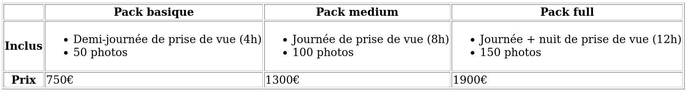
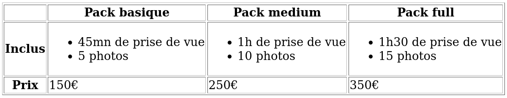
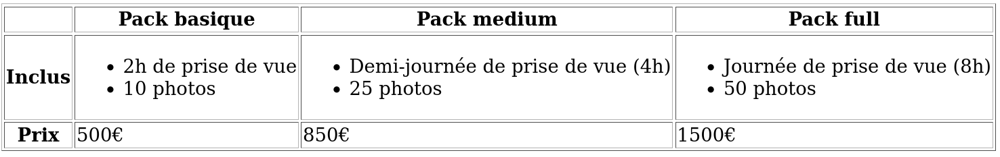

# Examen HTML

L'objectif de cet examen est de valider que les notions suivantes sont acquises
:

- Utilisation d'éléments HTML sémantiques adaptés aux différentes situation
- Organisation des titres dans une page web
- Structure de page sémantique
- Lien entre pages
- Utilisation de tableaux
- Envoi de données à un serveur avec un formulaire

Durée de l'examen : 2h45 (3h40 avec tiers temps).

## Enoncé

Vous travaillez pour un studio de photographes qui souhaite créer un site web.
Un prestataire a déjà travaillé en amont et a défini le contenu que le site
devra présenter. Il a conclu que le site devrait avoir 3 pages :

- Accueil : présentation générale du studio et présentation succinte de son offre
- Nos prestations : présentation plus détaillée de l'offre
- Nous contacter : formulaire de contact

### Elements similaires sur toutes les pages

Sur chaque page, on doit trouver un menu de navigation avec un lien pour chaque
page listée ci-dessus; ainsi qu'un pied de page contenant :

- Les coordonnées du studio :

```
Photozone
123 avenue de Versailles, Paris, France
+012 345 67890
info@photozone.com
```

Le numéro de téléphone et l'adresse mail doivent être des liens permettant
d'appeler ou d'envoyer un mail au studio directement en cliquant dessus.

- Un copyright : 

```
© Photozone. All Rights Reserved.
```

### Page Accueil

Sur cette page, en plus des éléments communs à toutes les pages, on doit
trouver 3 sections.

Une première composée de :

- un titre principal : `Studio de photographes basé à Paris`
- un paragraphe :

```
Nous sommes de véritables artistes, professionnels & passionnés par la
photographie. Pour nous, chaque client est unique, et nous nous adaptons à tous
vos besoins spécifiques.
```

Puis une section composée de :

- un titre : `Nous sommes des photographes créatifs professionels`
- un premier paragraphe :

```
La photographie est un art. Nous aimons jouer avec cet art afin de donner
libre cours à notre créativité débordante. Nos photos sauront vous
surprendre : elles seront originales, mais combleront vos attentes. On
vous le garantit !
```

- un second paragraphe :

```
Nous vous proposons des services adaptés :
```

- une liste non ordonnée composée des items suivants :
	- Galerie en ligne protégée par mot de passe
	- Livré sous 6 jours
	- Livraison des supports physiques à votre domicile, gratuit à partir de 150€

Suivi d'une section composée de :

- un titre : `Notre offre`
- 3 éléments associant une image à un texte sur lequel est apposé un lien :
	- Image `wedding.jpg` / texte `Mariage`; lien vers la page `Nos prestations`
	- Image `portrait.jpg` / texte `Portrait`; lien vers la page `Nos prestations`
	- Image `corporate.jpg` / texte `Corporate`; lien vers la page `Nos prestations`

Vous pouvez télécharger une archive ZIP contenant les images en cliquant sur le
lien suivant : [télécharger l'archive contenant les images](./images.zip).

Bonus : les liens vers la page `Nos prestations` doivent mener l'utilisateur
vers la section de la page correspondant au type d'offre sélectionné. Par
exemple, si l'utilisateur click sur le lien `Corporate`, son écran doit
afficher directement la section affichant les tarifs "Corporate".

### Page Nos Prestations

Sur cette page, en plus des éléments communs à toutes les pages, on souhaite
afficher :

- Un titre principal : `Nos prestations`
- Une section avec :
	- Un titre `Mariage`
	- Un tableau de prix pour les mariages :



- Une section avec :
	- Un titre `Portrait`
	- Un tableau de prix pour les portraits :



- Une section avec :
	- Un titre `Corporate`
	- Un tableau de prix pour les photos corporate :



### Page Nous Contacter

Sur cette page, en plus des éléments communs à toutes les pages, on souhaite
afficher :

- Un titre principal : `Nous contacter`
- Un formulaire avec les champs suivants :
	- Nom : champ de type texte, requis
	- Adresse e-mail : champ de type email, requis
	- Message : champ texte multiligne, requis
	- Un bouton d'envoi avec le texte `Envoyer le message`

Les données du formulaire doivent être envoyées sur l'URL
`https://http-mirror.vercel.app/api/mirror` avec la méthode la plus adaptée.

## Envoyer votre travail

Faites une archive ZIP du dossier contenant votre travail et envoyez-la par
mail.

## Barême

- Utilisation d'éléments HTML sémantiques adaptés aux différentes situation : 5 points
- Organisation des titres dans une page web : 2 points
- Structure de page sémantique : 2 points
- Lien entre pages : 4 points
- Utilisation de tableaux : 3 points
- Envoi de données à un serveur avec un formulaire : 4 points
