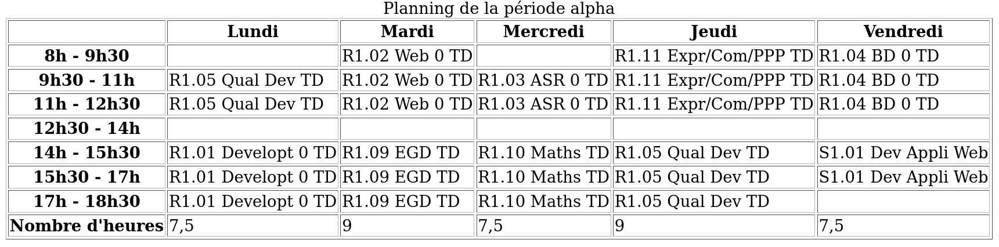
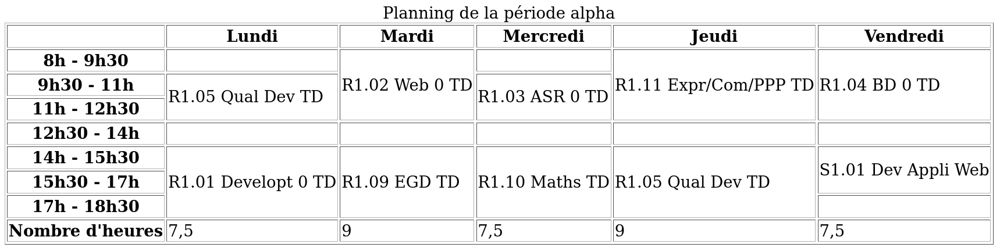

# Exercice tableaux HTML

L'objectif de cet exercice est de créer un tableau représentant le plaanning
d'une semaine de cours à l'IUT.

Le tableau à créer est le suivant :

Une fois que vous avez réussi à créer ce tableau, utilisez les attributs
`rowspan` et `colspan` pour fusionner les cellules correspondant aux même cours
sur des créneaux adjacents. Voir l'exemple suivant :

* [Solution sans fusion](./solution.html)
* [Solution avec fusion](./solution-fusion.html)
